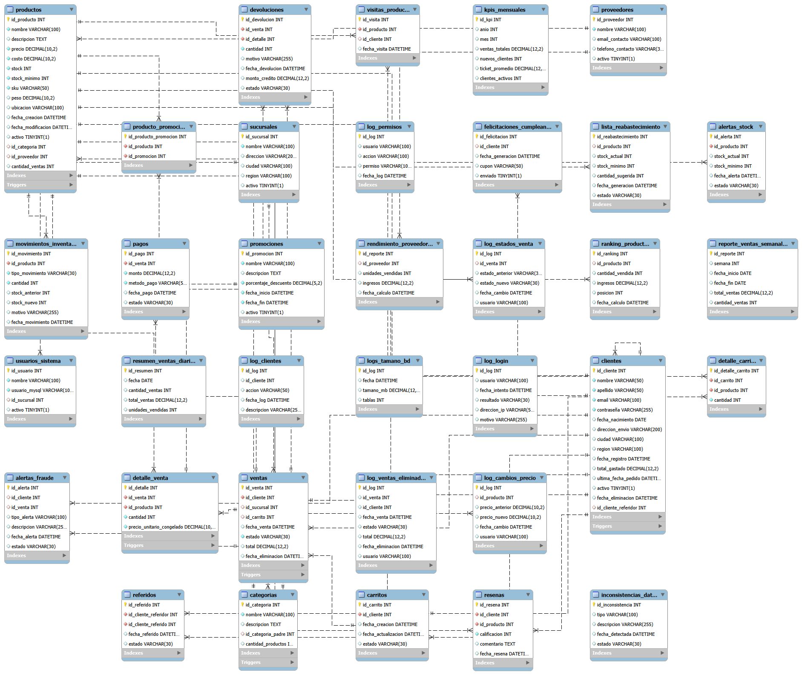

# Proyecto de Base de Datos para un E-commerce

## Descripción del Proyecto

Este proyecto consiste en el diseño y desarrollo de una base de datos para un sistema de E-commerce. El objetivo es crear una estructura que permita administrar de forma organizada la información relacionada con productos, categorías, proveedores, clientes, ventas y otros procesos necesarios para el funcionamiento de una tienda en línea.

Además de crear las tablas y relaciones principales, el proyecto incluye diferentes herramientas de MySQL para trabajar y automatizar los procesos de la base de datos. Se implementaron consultas avanzadas para analizar la información, funciones para realizar cálculos y validaciones, roles y permisos para controlar el acceso, triggers para automatizar acciones, eventos para ejecutar tareas de forma programada y procedimientos almacenados para realizar operaciones específicas.


## Objetivo

El objetivo principal es poner en práctica los conocimientos de bases de datos avanzadas utilizando MySQL y construir una base de datos funcional para un E-commerce.

La base de datos permite trabajar con la información de los productos y clientes, registrar ventas, controlar inventario y realizar diferentes análisis que pueden ayudar a conocer el comportamiento del negocio.


## Estructura del Proyecto



El proyecto está dividido en varios archivos SQL para mantener el código organizado y facilitar su ejecución y revisión.

### `01_Esquema_y_Datos.sql`

Este archivo contiene la creación de la base de datos y de las tablas necesarias para el proyecto.

También contiene los datos de ejemplo utilizados para poder realizar las consultas y probar las diferentes funcionalidades.


### `02_Consultas_Avanzadas.sql`

Este archivo contiene las 20 consultas avanzadas solicitadas para analizar la información de la base de datos.

Las consultas permiten obtener información como:

- Productos con mayores ingresos.
- Productos con bajas ventas.
- Clientes con mayor gasto.
- Ventas agrupadas por mes.
- Nuevos clientes.
- Clientes con compras repetidas.


### `03_Funciones.sql`

Este archivo contiene las 20 funciones creadas para realizar diferentes cálculos y validaciones dentro de la base de datos.

Entre ellas se encuentran funciones para calcular totales, verificar disponibilidad de productos, obtener precios, calcular edades, calcular costos de envío, aplicar descuentos, calcular IVA y validar información.

### `04_Seguridad.sql`

Este archivo contiene la configuración de seguridad de la base de datos.

Se crean diferentes roles y usuarios y se asignan permisos dependiendo de las funciones que cada usuario puede realizar dentro del sistema.

### `05_Triggers.sql`

Este archivo contiene los triggers utilizados para automatizar diferentes acciones de la base de datos.

Entre sus funciones se encuentran el control del stock, registro de cambios de precios, actualización de información de clientes, control de ventas y generación de registros de auditoría.

### `06_Eventos.sql`

Este archivo contiene los eventos programados de la base de datos.

Los eventos permiten realizar automáticamente diferentes tareas en determinados períodos de tiempo, como generar reportes, actualizar información, revisar datos y realizar tareas de mantenimiento.

### `07_Procedimientos_Almacenados.sql`

Este archivo contiene los 20 procedimientos almacenados del proyecto.

Los procedimientos permiten realizar operaciones como registrar clientes, crear ventas, actualizar direcciones, ajustar inventario, procesar pagos, buscar productos, generar reportes y administrar diferentes procesos del E-commerce.

## Instrucciones de Ejecución

Para ejecutar correctamente el proyecto se debe seguir el orden de los archivos SQL, ya que algunos elementos dependen de estructuras creadas anteriormente.

### Paso 1. Crear la base de datos

Ejecutar:

01_Esquema_y_Datos.sql


### Paso 2. Consultas avanzadas

Abrir el archivo:

`02_Consultas_Avanzadas.sql`

Ejecutar las consultas que se quieran revisar. Cada consulta muestra información diferente de la base de datos, como productos más vendidos, clientes, ventas, inventario y otros datos importantes del E-commerce.

No es necesario ejecutar todas las consultas al mismo tiempo. Se pueden ejecutar individualmente para revisar los resultados.

### Paso 3. Funciones

Abrir el archivo:

`03_Funciones.sql`

Ejecutar todo el archivo para crear las 20 funciones.

Después de crearlas, se pueden probar utilizando `SELECT` junto con el nombre de la función y los parámetros que necesite.

Por ejemplo:

```sql
SELECT fn_CalcularIVA(100);
```

### Paso 4. Seguridad

Abrir el archivo:

`04_Seguridad.sql`

Ejecutar el archivo para crear los roles, usuarios y permisos establecidos para el proyecto.

Para revisar que los permisos fueron asignados correctamente, se puede utilizar `SHOW GRANTS`.

Por ejemplo:

```sql
SHOW GRANTS FOR 'admin_user'@'localhost';
```

### Paso 5. Triggers

Abrir el archivo:

`05_Triggers.sql`

Los triggers no se ejecutan utilizando `CALL` ni `SELECT`. Funcionan automáticamente cuando se realiza la acción relacionada con ellos.

Por ejemplo, al cambiar el precio de un producto, el trigger correspondiente registra el cambio en la tabla de auditoría.

Se puede revisar el resultado con:

```sql
SELECT * FROM log_cambios_precio;
```

### Paso 6. Eventos

Abrir el archivo:

`06_Eventos.sql`

Ejecutar todo el archivo para crear los 20 eventos programados.

Los eventos se ejecutan automáticamente según el tiempo establecido para cada uno.

Para comprobar que el `event_scheduler` está activo:

```sql
SHOW VARIABLES LIKE 'event_scheduler';
```

### Paso 7. Procedimientos almacenados

Abrir el archivo:

`07_Procedimientos_Almacenados.sql`

Ejecutar todo el archivo para crear los 20 procedimientos almacenados.

Los procedimientos se utilizan mediante `CALL`, indicando los parámetros que necesita cada procedimiento.

Por ejemplo:

```sql
CALL sp_ObtenerHistorialComprasCliente(1);
```